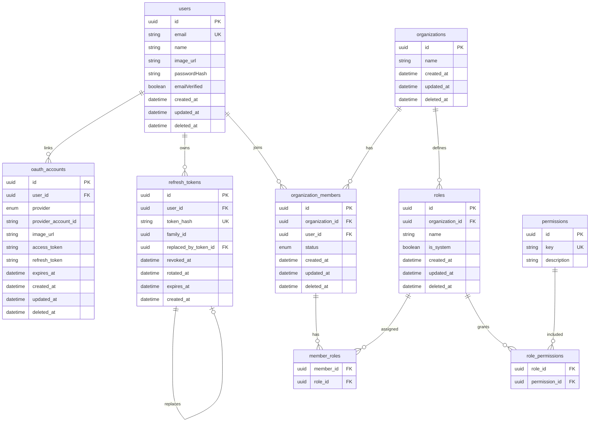

# OpsPilot Backend Architecture

## Goal

OpsPilot is a modular monolith backend designed to demonstrate middle-level backend engineering skills with clean boundaries, multi-tenant access control, CQRS-style use cases, and production-like infrastructure.

## Runtime Processes

The codebase is prepared for three process types:

- API process: HTTP API and future WebSocket server.
- Worker process: RabbitMQ consumers for async jobs.
- Scheduler process: outbox publisher and scheduled jobs.

Week 1 implements the API foundation first.

## Environment Configuration

Docker Compose reads infrastructure configuration from the root `.env` file.

```txt
.env
docker-compose.yml
```

The API process reads runtime configuration from `apps/api/.env`.

```txt
apps/api/.env
apps/api/src/shared/config/env.ts
```

Secrets, ports, image names, and service credentials should not be hard-coded in Compose or application source. Keep real values in ignored `.env` files and commit only `.env.example` templates.

## API Documentation

The API exposes a Swagger UI and raw OpenAPI document:

```txt
GET /docs
GET /openapi.json
```

The OpenAPI spec is kept in code at `src/shared/openapi/openapi.ts` for the first milestone. When the API surface grows, move repeated schemas into module-owned OpenAPI fragments or generate the spec from route schemas.

## Error Handling

Domain errors are centralized in `src/shared/errors/error-catalog.ts`.

Use:

```ts
throw domainError('AUTH_INVALID_CREDENTIALS');
```

Instead of scattering raw status codes and messages across services. This keeps API responses consistent and makes it easier to localize, document, or audit error behavior later.

Prisma known errors are mapped in the global error handler through `mapPrismaError()`. For example, unique constraint errors become a standard `DATABASE_UNIQUE_CONSTRAINT` response. Route handlers should use `asyncHandler()`, so most application code does not need local `try/catch` blocks.

## Password Hashing

`argon2` is used to hash and verify user passwords. Passwords are never stored in plain text. Argon2 is a modern password hashing algorithm designed to be slow and memory-hard, which makes brute-force attacks more expensive than using general-purpose hashes like SHA-256.

## JWT ID

`jti` means JWT ID. It is a unique identifier inside a JWT payload. Refresh tokens include a random `jti` so every issued refresh token is unique even if the user ID, email, and expiration window are similar.

## Module Layout

Each business module should follow this shape:

```txt
modules/<module-name>/
  domain/
  application/
  infrastructure/
  presentation/
```

Rules:

- Domain does not import Express, Prisma, Redis, RabbitMQ, or MinIO.
- Application contains use cases and port interfaces.
- Infrastructure implements ports with Prisma, Redis, RabbitMQ, or MinIO.
- Presentation owns HTTP routes, controllers, and validation.

## Multi-Tenant Rule

`organizationId` is the tenant boundary. Tenant-owned resources must always be queried with both resource ID and organization ID.

```ts
where: {
  id: resourceId,
  organizationId,
}
```

Cross-tenant resource access should usually return `404` to avoid leaking resource existence.

## Database Decisions

### IDs

Primary keys use PostgreSQL native `UUID` columns through Prisma:

```prisma
id String @id @default(uuid()) @db.Uuid
```

`cuid()` was avoided because it stores string identifiers rather than native database UUIDs. UUID is a better default here because it is familiar in backend interviews, works well across distributed processes, and maps cleanly to PostgreSQL.

### User Profile Fields

`users` stores profile data that can come from password auth or OAuth2:

- `name`
- `image_url`
- `email_verified`

`oauth_accounts` also stores provider-level `image_url` because the provider avatar may differ from the user's canonical profile image.

### Organizations

Organizations do not use `slug` in the current MVP. The API identifies organizations by UUID:

```txt
GET /orgs/:orgId
```

A slug can be added later if the frontend needs human-readable workspace URLs. Keeping it out now avoids early uniqueness and rename behavior that does not yet serve a product workflow.

### Soft Delete

Soft deletion is represented with nullable `deleted_at`.

Current soft-delete models:

- `users`
- `oauth_accounts`
- `organizations`
- `organization_members`
- `roles`

Application queries must filter active records with `deletedAt: null`. For cross-tenant or deleted organization access, return `404`.

Join tables such as `member_roles` and `role_permissions` are hard-deleted because they represent assignments, not long-lived business records. `refresh_tokens` are revoked with `revoked_at` instead of soft-deleted.

### Refresh Token Rotation

Refresh tokens are stored as SHA-256 hashes. The raw refresh token is returned once to the client and never stored.

Rotation behavior:

- Login/register creates an access token and refresh token.
- Refresh verifies the presented refresh token.
- A new refresh token is created in the same transaction.
- The old refresh token is marked with `revoked_at`, `rotated_at`, and `replaced_by_token_id`.
- If an already revoked refresh token is used again, the token family is revoked and the request is rejected.

The schema uses:

- `family_id` to group a refresh token chain.
- `replaced_by_token_id` to link old token to new token.
- `revoked_at` to invalidate a token.
- `rotated_at` to record normal rotation.

This provides basic rotation and reuse detection without introducing a full session-management system yet.

## Current Schema Overview



## Week 1 Deliverables

Milestone 0:

- TypeScript + Express setup.
- Prisma + PostgreSQL setup.
- Redis, RabbitMQ, MinIO clients.
- Docker Compose infrastructure.
- Pino logger.
- Zod validation.
- Global error handler.
- `GET /health`.
- `GET /ready`.
- Vitest + Supertest smoke tests.

Milestone 1:

- Register.
- Login.
- Refresh token.
- Logout.
- Current user.
- OAuth2-ready account model and extension points.
- Create organization.
- List user organizations.
- Get organization detail.

OAuth2 is included in Week 1 as a basic identity capability: the schema and provider callback surface are prepared first, then concrete providers can be wired through configuration.
